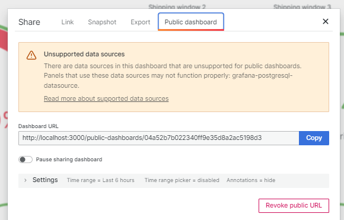
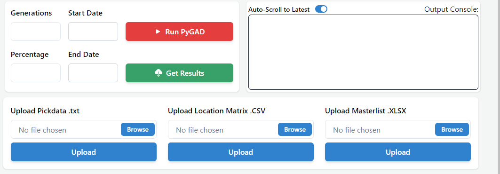

# Initial deployment setup (on a server and local)

## General Requirements
- Updated Windows/Linux(debian) system.
- Docker installed with the Docker daemon active.

## METHOD 1: Automatic Deployment to server via github actions:  
### Step 1: Repository Setup for System Deployment

To deploy the system to a different server than the original repository, follow these steps for a smooth setup:

#### Repository Secrets
Create a new repository and establish the following secrets within it for the GitHub Actions. These secrets are used to securely deploy your system to your server:

- `GHCR_USERNAME`: Your Docker registry username.
- `GRAFANA_ADMIN_PASSWORD`: Admin password for the Grafana dashboard.
- `PAT`: Personal Access Token for GitHub to authenticate CI/CD operations.
- `POSTGRES_DB`: The database name for your PostgreSQL.
- `POSTGRES_PASSWORD`: Password for your PostgreSQL database.
- `POSTGRES_USER`: Username for accessing the PostgreSQL database.
- `SERVER_HOST`: Hostname or IP address of your deployment server.
- `SERVER_USERNAME`: Server username for SSH access.
- `SSH_PRIVATE_KEY`: Private key for SSH access to the server.

#### Cloning and Branching
Clone the repository from the provided link and push your changes to a new branch named `release`. Ensure that the GitHub Actions workflows in `.github/workflows` are correctly pointing to your branch. For example, if your branch is named `release_1_14_24`, the workflow files should reference it accordingly:

```yaml
on:
  push:
    branches:
      - release_1_14_24
```

#### Configuration Changes
Change the necessary credentials and ip's/domains  in your code:

- Backend environment settings at `Backend/django_backend_sob3/app/.env`.
- Django settings at `Backend/django_backend_sob3/app/warehouse_project/settings.py`.
- Frontend configuration at `Frontend/dashboard/src/config.tsx`.

#### Ports and Dockerfiles
For any port changes, update the respective Dockerfiles:

- `Frontend/dashboard/Dockerfile`
- `Backend/redis/Dockerfile`
- `Backend/postgres_database/Dockerfile`
- `Backend/grafana/Dockerfile`
- `Backend/django_backend_sob3/Dockerfile`

#### GitHub Workflows
Adjust the `.github/workflows` to change ports and service names as required.


### 2. Step:  Pushing Configured Code
After cloning and configuring the code, push it to the newly created release branch. This will trigger the GitHub Actions to deploy the code to your server.

### 3. Step Reviewing Deployment
Monitor the deployment process in the Actions tab on GitHub to ensure everything is proceeding correctly at
https://github.com/your-reposetory/actions .
### 4. Step: Grafana - Dashboards Setup
Access Grafana through `http://<your-server-ip>:3000` and log in with the credentials you set up in the secrets.

#### Importing Dashboards
Once logged in to Grafana:
- Import the dashboard configurations from the `grafana` folder located in the backend directory.

#### Generating Public Dashboard Links
To share your dashboards:
- Generate a public link from the Grafana service.
- Remember to replace `localhost` with your server IP or domain in the generated URL.
- Update the React frontend's `config.tsx` file with the new URL to point to your Grafana dashboards.



#### Updating Frontend Iframes in Components
In your React project:
- Embed the new Grafana dashboard URLs where iframes are used.
- Ensure all links point to the correct server IP and not localhost.


### 5. Step: (OPTIONAL) Establishing Secure Domain Connection via Cloudflare
For enhanced security and simplified domain management, connect your domain to the server's IP address using Cloudflare. This enables HTTPS encryption for secure communication. 

Of course if changes config file changes where made for this in the resposetory, another push to the release branch is required trigger the actions again implement the changes at server side. 


### 6. Step: Accessing the Frontend and Finishing Setup Process

#### Database Initialization Steps
To properly initialize the system's database, follow these steps in the EXACT order:

1. **Location Matrix**: Begin by uploading the location matrix. This data forms the foundation of the warehouse layout and must be set up first.

2. **Masterlist Upload**: Once the location matrix is set, proceed to upload the masterlist, which contains all item details and storage requirements.

3. **Pick Data Upload**: After the masterlist, upload the pick data. This step is crucial as it provides the necessary information for the optimization algorithm.

It's critical to execute these steps sequentially to ensure the system's data integrity and operational functionality.


#### Algorithm Execution
With the data in place:

- Start the optimization algorithm with a smaller number of generations (between 100 and 1000) to quickly generate a feasible solution and check 

### Final Checks
After completing the setup:

- Ensure that Grafana dashboard URLs are correctly integrated into the frontend and displaying the expected data and they are showing graphs after successfully finishing a pyGAD run.
- Confirm that all system services are active and running smoothly.
- Check that the frontend and backend connections are functioning correctly.


##
##
##
##


## METHOD 2: Local Deployment for development:

### Local Development Process Using Docker Containers

During the development phase, we implemented Celery and Redis for efficient task and message queue handling. This integration is critical for our Django application, facilitating the development and testing of background tasks and real-time communication features. So the easiest way for working on further development is directly witin a docker service locally.

### Why Use Docker Services for Development

#### Instant Code Updates with Django
For Django development, we construct a Docker container from the local files within your IDE, such as VS Code. This setup allows for hot-reloading; when you save changes, the container automatically reloads, updating the backend instantaneously. This feature streamlines the development cycle, reducing downtime, and improving productivity. And ensures that the services already runns smoothly on a docker container, so the deployment process later on is likely not causing any issues. 

#### Consistency Across Services
Similarly, using Docker for Grafana, Redis, and PostgreSQL ensures consistency across various environments. With containers, each service is isolated with its dependencies, eliminating the "works on my machine" problem and mimicking production settings closely.

#### Centralized Database and Monitoring
We opted for a centralized PostgreSQL database and Grafana monitoring for convenience. This approach allows developers to connect to a stable, persistent database and monitoring service, avoiding the need to replicate data and configurations locally.


### Initializing Docker Swarm

Before setting up the local environment, ensure Docker Swarm mode is active:
```shell
# Initialize Docker Swarm if it's not already active
docker swarm init || true
```

### Creating the Docker Network
Ensure that a dedicated network for your services exists:


### Create a network or verify if it already exists
```shell
docker network create sod3_dev_network || true
```


### Create Necessary Values
```shell
#grafana volume
docker volume create grafana_volume
#posgtes volume
docker volume create postgres_volume
# if deploying manually on a server, also create a volume for django, instead of using the direct storage as done for development.
```


### Building Docker Images
Before deploying services with Docker Swarm, you need to build the Docker images from the Dockerfiles. Here are the commands to build each service:

```shell
# Build the Frontend image from the Dockerfile
docker build -t frontend-dashboard:dev -f Frontend/dashboard/Dockerfile .

# Build the Redis image from the Dockerfile
docker build -t redis-backend:dev -f Backend/redis/Dockerfile .

# Build the PostgreSQL database image from the Dockerfile
docker build -t postgres-database:dev -f Backend/postgres_database/Dockerfile .

# Build the Grafana image from the Dockerfile
docker build -t grafana-backend:dev -f Backend/grafana/Dockerfile .

# Build the Django backend image from the Dockerfile
docker build -t django-backend:dev -f Backend/django_backend_sob3/Dockerfile .
```


### Final Setup -  Docker Services:
To set up your local development environment with Docker Swarm, use the following commands:

```shell
# Make sure you start fresh and every service is removed
docker service rm dev_django_backend_service || true
docker service rm dev_react_service || true
docker service rm dev_redis_service || true
docker service rm dev_grafana_service || true
docker service rm dev_postgres_service || true
```

#### Setup PostgreSQL Database Service
Create and run the PostgreSQL database service using a Docker volume for data persistence:

```shell
# Setup the PostgreSQL database service
docker service create \
  --name dev_postgres_service \
  --network sod3_dev_network \
  --publish published=5432,target=5432 \
  --mount type=volume,source=postgres_volume,target=/var/lib/postgresql/data \
  postgres-database-dev || \
  docker service update --force --image postgres-database-dev dev_postgres_service
```

#### Setup Django Backend Service with direct storage as volume for HOT RELOAD 
```shell
# Setup the Django service
docker service create \
  --name dev_django_backend_service \
  --network sod3_dev_network \
  --publish published=8001,target=8001 \
  --mount type=bind,source="$(pwd)"/Backend/django_backend_sob3,target=/app \
  django-backend-dev || \
  docker service update --force --image django-backend-dev dev_django_backend_service
```

#### Setup the Frontend (EASY METHOD) 

```shell
# Navigate to the Frontend dashboard directory
cd Frontend/dashboard

# Install dependencies
npm install

# Start the development server
npm run dev
```


#### Setup the Frontend as service (using direct storage as volume)
```shell
# Deploy the Frontend service
docker service create \
  --name dev_frontend_service \
  --network sod3_dev_network \
  --publish published=80,target=80 \
  --mount type=bind,source="$(pwd)"/Frontend/dashboard,target=/ \
  frontend-dashboard-dev || \
  docker service update --force --image frontend-dashboard-dev dev_frontend_service
```

#### Setup Grafana service for dashboard visualization
```shell
# Deploy the Grafana service
docker service create \
  --name dev_grafana_service \
  --network sod3_dev_network \
  --env GF_SECURITY_ADMIN_PASSWORD="YOUR_PASSWORD" \
  --env GF_SECURITY_ALLOW_EMBEDDING="true" \
  --publish published=3001,target=3001 \
  --mount type=volume,source=grafana_volume,target=/var/lib/grafana \
  grafana-dev || \
  docker service update --force --image grafana-dev dev_grafana_service
```

#### Setup Redis service
```shell
# Deploy the Redis service
docker service create \
  --name dev_redis_service \
  --network sod3_dev_network \
  --publish published=6379,target=6379 \
  redis-dev || \
  docker service update --force --image redis-dev dev_redis_service
```

### Grafana Dashboard Setup for Local Development
For setting up Grafana dashboards locally, refer to the steps outlined in Method 1: Automatic Deployment to Server. The process remains largely the same; however, ensure you access Grafana through the local server's IP and the port you defined (default: `3001`).

### Final Local System Checks and Access
Once all services are deployed:
- Verify that each service is up and running by checking the Docker service status using the folling command: `docker service ls`
- Access the frontend either through the development server at `http://localhost:<frontend-port>` or through the Docker service at `http://<local-ip>:80`, depending on your chosen method of deployment.
- Confirm that the backend, Redis, and Grafana services are all communicating effectively with each other.
- Ensure Grafana dashboards are accessible and displaying data as expected.